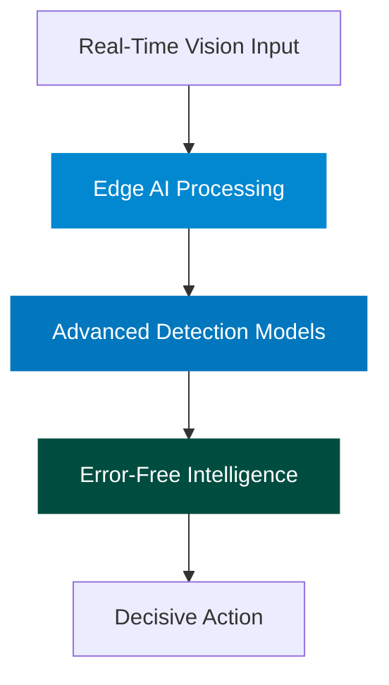

<h1 align="center">「 ENDR 」</h1>

## Table of Contents
[[Redefining Precision in Critical Decision Systems](#redefining-precision-in-critical-decision-systems)]  [[Breakthrough Technology](#breakthrough-technology)]  [[Next-Gen Edge AI Architecture](#next-gen-edge-ai-architecture)]  [[Research Frontiers](#research-frontiers)]  [[Perfect Perception Systems](#perfect-perception-systems)]  [[Get in Touch](#get-in-touch)]
<!-- <div align="center">
    <picture>
        <source 
            srcset="./Endr - Logos/Background(B).png#gh-dark-mode-only"
            media="(prefers-color-scheme: dark)"
        />
        <source
            srcset="./Endr - Logos/Background(W).png#gh-light-mode-only"
            media="(prefers-color-scheme: light)"
        />
        
    </picture>
</div> -->

## Redefining Precision in Critical Decision Systems

**Endr** is a pioneering research company developing advanced **Edge AI** and **computer vision** technologies for defense applications. We focus on eliminating **Type 1 errors** (false positives) in **threat detection** systems—a critical advancement that allows **military, law enforcement, and security personnel** to make split-second decisions confidently. Our Edge AI solutions offer faster response times, enhanced privacy, and reliable operation even in disconnected environments by processing data directly on-device rather than in the cloud. Our mission bridges military-grade protection with commercial and educational applications, creating a safer world through perfect perception technology.

## Breakthrough Technology

<div align="center">



</div>

### Next-Gen Edge AI Architecture

Our cutting-edge solutions process data directly on the edge, delivering:

- Ultra-fast response times
- Uncompromised data privacy and security
- Seamless operation in offline environments
- Minimal bandwidth usage
- Energy-efficient performance

## Research Frontiers

| Domain | Innovations | Real-World Impact |
|--------|-------------|--------------------|
| **Computer Vision** | Advanced object detection, predictive analytics, anomaly recognition | Threat neutralization, proactive security |
| **Edge Computing** | AI model compression, hardware-software co-design | Autonomous systems, tactical intelligence |
| **Error Mitigation** | Probabilistic modeling, sensor fusion, adaptive learning | Near-zero false positives in mission-critical systems |
| **Autonomous Systems** | AI-driven decision-making, robotics synergy, multi-sensor integration | Smart drones, unmanned operations |

## Perfect Perception Systems

Our groundbreaking research is shaping the future of perception technology—delivering computer vision systems that achieve near-zero Type I errors while maintaining unparalleled sensitivity and reliability.

## Get in Touch

```
Endr, LLC
Seattle, WA
ezekiel@endr.us
https://endr.us
```
  [](https://github.com/endr-us)
---

© 2025 Endr, LLC | Pioneering the future of perception technology
