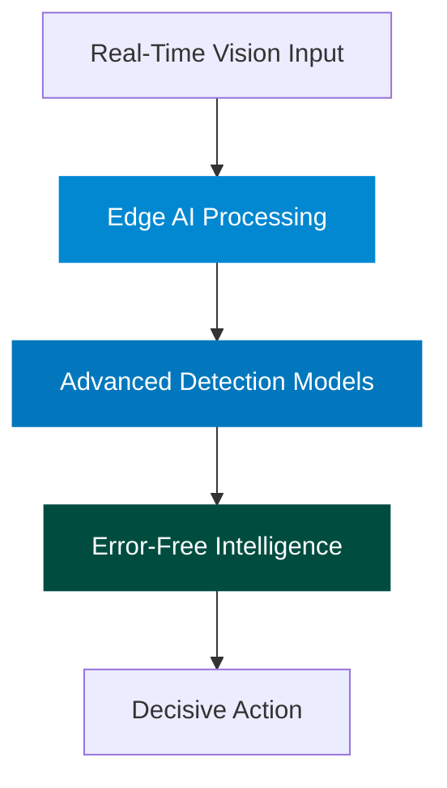

# ENDR | Computer Vision for Edge AI

<div align="center">
    
</div>

## Redefining Precision in Critical Decision Systems

Endr is at the forefront of innovation, revolutionizing Edge AI and computer vision technologies for defense and security. Our mission is to eradicate Type I errors (false positives) in threat detection systems, empowering military, law enforcement, and security professionals to make life-critical decisions with unmatched precision and confidence.

## Breakthrough Technology

<div align="center">



</div>

### Next-Gen Edge AI Architecture

Our cutting-edge solutions process data directly on the edge, delivering:

- **Ultra-fast response times**
- **Uncompromised data privacy and security**
- **Seamless operation in offline environments**
- **Minimal bandwidth usage**
- **Energy-efficient performance**

## Research Frontiers

| Domain | Innovations | Real-World Impact |
|--------|-------------|--------------------|
| **Computer Vision** | Advanced object detection, predictive analytics, anomaly recognition | Threat neutralization, proactive security |
| **Edge Computing** | AI model compression, hardware-software co-design | Autonomous systems, tactical intelligence |
| **Error Mitigation** | Probabilistic modeling, sensor fusion, adaptive learning | Near-zero false positives in mission-critical systems |
| **Autonomous Systems** | AI-driven decision-making, robotics synergy, multi-sensor integration | Smart drones, unmanned operations |

## Perfect Perception Systems

Our groundbreaking research is shaping the future of perception technology—delivering computer vision systems that achieve near-zero Type I errors while maintaining unparalleled sensitivity and reliability.

## Get in Touch

```
Endr, LLC
Seattle, WA
ezekiel@endr.us
https://endr.us
```

---

© 2025 Endr, LLC | Pioneering the future of perception technology